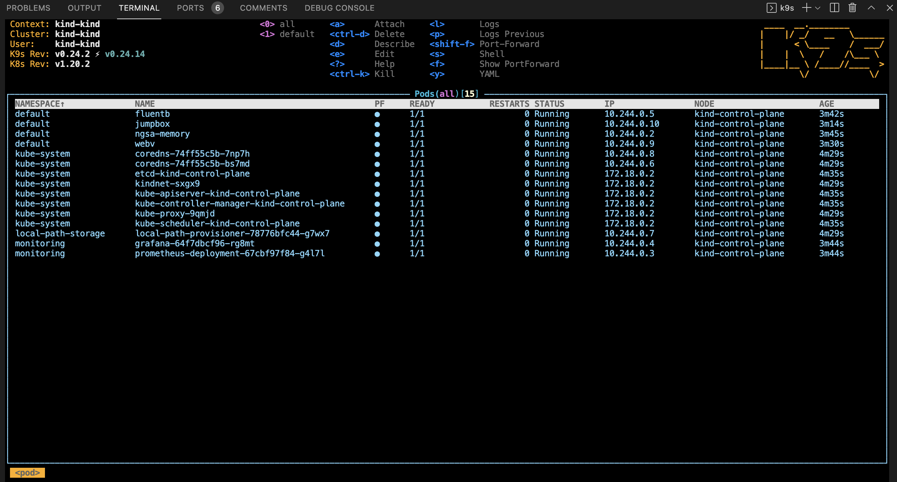
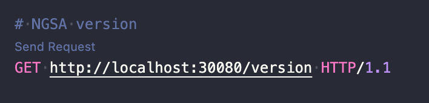
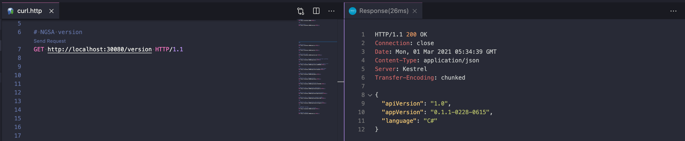
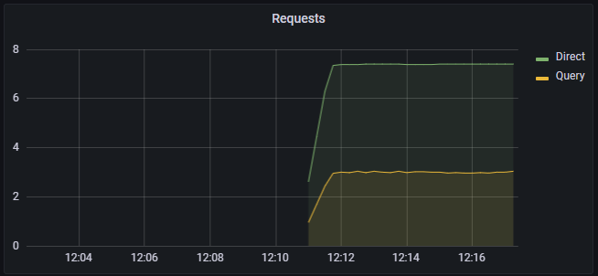
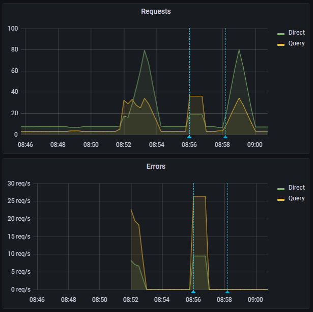

# Kubernetes in Droplets

> Setup a Kubernetes cluster using `k3d` running in a `Droplet`


## Overview

> Note: the `Droplet` install script is not fully automated yet

This is a template that will setup a Kubernetes developer cluster using `k3d` in a `Digital Ocean Droplet`

We use this for `inner-loop` Kubernetes development. Note that it is not appropriate for production use but is a great `Developer Experience`. Feedback calls the approach `game-changing` - we hope you agree!

For ideas, feature requests, and discussions, please use GitHub discussions so we can collaborate and follow up.

Please experiment and add any issues to the GitHub Discussion. We LOVE PRs!

## Build and Deploy a k3d Cluster

  ```bash

  # build the cluster
  make all

  ```

## Validate Deployment

Output from `make all` should resemble this

```text

default      jumpbox                                   1/1   Running   0   25s
logging      fluentbit                                 1/1   Running   0   31s
monitoring   grafana-64f7dbcf96-cfmtd                  1/1   Running   0   32s
monitoring   prometheus-deployment-67cbf97f84-tjxm7    1/1   Running   0   32s

```

```bash

# check endpoints
make check

```

## Service endpoints

- All endpoints are usable in your browser via `ctl+click`
  - We map the `NodePorts by removing a zero
    - https is provided by `Caddy` and `Let's Encrypt`
  - Application <https://sfo.bartr.co>
  - WebValidate <https://sfo.bartr.co:3088/metrics>
  - Prometheus <https://sfo.bartr.co:3000>
  - Grafana <https://sfo.bartr.co:3200>
    - Login: admin
    - Password: (ask me)

## Validate deployment with k9s

- From the Code-Server terminal window, start `k9s`
  - Type `k9s` and press enter
  - Press `0` to select all namespaces
  - Wait for all pods to be in the `Running` state (look for the `STATUS` column)
  - Use the arrow key to select `nsga-memory` then press the `l` key to view logs from the pod
  - To go back, press the `esc` key
  - Use the arrow key to select `jumpbox` then press `s` key to open a shell in the container
    - Hit the `ngsa-memory` NodePort from within the cluster by executing `http ngsa-memory:8080/version`
    - Verify 200 status in the response
    - To exit - `exit`
  - To view other deployed resources - press `shift + :` followed by the deployment type (e.g. `secret`, `services`, `deployment`, etc).
  - To exit - `:q <enter>`



### Other interesting endpoints

Open [curl.http](./curl.http)

> [curl.http](./curl.http) is used in conjuction with the Visual Studio Code [REST Client](https://marketplace.visualstudio.com/items?itemName=humao.rest-client) extension.
>
> When you open [curl.http](./curl.http), you should see a clickable `Send Request` text above each of the URLs



Clicking on `Send Request` should open a new panel in Visual Studio Code with the response from that request like so:



## Jump Box

A `jump box` pod is created so that you can execute commands `in the cluster`

- use the `kj` alias to run a bash shell in the jumpbox
- use the `kje` alias to execute a command in the jumpbox
    ```bash
    
    kje http ngsa-memory:8080/version
    
    ```

## View Prometheus Dashboard

- Ctl+Click this link <https://sfo.bartr.co:3000>
- This will open Prometheus in a new browser tab

- From the Prometheus tab
  - Begin typing NgsaAppDuration_bucket in the `Expression` search
  - Click `Execute`
  - This will display the `histogram` that Grafana uses for the charts

## Launch Grafana Dashboard

- Ctl+Click the Grafana link <https://sfo.bartr.co:3200>
- Grafana login info
  - admin
  - (ask me)

## View Grafana Dashboard

- Click on `Home` at the top of the page
- From the dashboards page, click on `NGSA`



## Run a load test

```bash

# from terminal

# run a baseline test (will generate warnings in Grafana)
make test

# run a 60 second load test
make load-test

```

- Switch to the Grafana brower tab
- The test will generate 400 / 404 results
- The requests metric will go from green to yellow to red as load increases
  - It may skip yellow
- As the test completes
  - The metric will go back to green (1.0)
  - The request graph will return to normal



## View Fluent Bit Logs

- Start `k9s` from the terminal
- Press `0` to show all `namespaces`
- Select `fluentbit` and press `enter`
- Press `enter` again to see the logs
- Press `s` to Toggle AutoScroll
- Press `w` to Toggle Wrap
- Review logs that will be sent to Log Analytics when configured
  - See `deploy/loganalytics` for directions

## Build and deploy a local version of WebValidate

- Switch back to your Code-Server tab

```bash

# make and deploy a local version of WebV to k8s
make webv

```

## Build and deploy a local version of ngsa-memory

- Switch back to your Code-Server tab

```bash

# make and deploy a local version of ngsa-memory to k8s
make app

```

## Next Steps

> [Makefile](./Makefile) is a good place to start exploring

## FAQ

- Why `k3d` instead of `Kind`?
  - We love kind! Most of our code will run unchanged in kind (except the cluster commands)
  - We had to choose one or the other as we don't have the resources to validate both
  - We chose k3d for these main reasons
    - Smaller memory footprint
    - Faster startup time
    - Secure by default
      - K3s supports the [CIS Kubernetes Benchmark](https://rancher.com/docs/k3s/latest/en/security/hardening_guide/)
    - Based on [K3s](https://rancher.com/docs/k3s/latest/en/) which is a certified Kubernetes distro
      - Many customers run K3s on the edge as well as in CI-CD pipelines
    - Rancher provides support - including 24x7 (for a fee)
    - K3s has a vibrant community
    - K3s is a CNCF sandbox project

## How to file issues and get help  

This project uses GitHub Issues to track bugs and feature requests. Please search the existing issues before filing new issues to avoid duplicates. For new issues, file your bug or feature request as a new issue.

For help and questions about using this project, please open a GitHub issue.

## Contributing

This project welcomes contributions and suggestions.  Most contributions require you to agree to a Contributor License Agreement (CLA) declaring that you have the right to, and actually do, grant us the rights to use your contribution.

## Trademarks

This project may contain trademarks or logos for projects, products, or services.

Any use of third-party trademarks or logos are subject to those third-party's policies.
